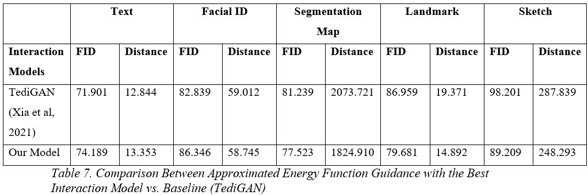

# ✨ **MATCHE Diffusion**

**M**ulti-conditional **A**pproximated **T**ime-independent **C**ondition **H**armonizing **E**nergy **G**uidance

> A training-free framework for multi-conditional image generation using harmonized energy-based denoising.

---
 
**📍 Nanyang Technological University**  
*College of Computing and Data Science*  
**Final Year Project: Automated Image Generation (CCDS24-0163)**


---

### 📜 Abstract

Multi-conditional image generation aims to synthesize images that satisfy diverse conditions, such as textual descriptions, segmentation masks, and landmark constraints. Existing training-free approaches often fail to capture complex interdependencies among multiple conditions. This project introduces a novel framework leveraging a time-independent approximated energy guidance function with interaction modeling to address this limitation. Our method guides an iterative denoising process to progressively refine generated images, capturing non-linear dependencies between conditions. Experimental results demonstrate that our approach outperforms existing techniques in producing coherent, condition-consistent images while maintaining high fidelity.

---

### 📌 Project Overview

This project explores training-free multi-conditional image generation, enhancing the denoising process in diffusion models through approximated time-independent energy-based guidance and interaction modeling. Our method dynamically handles multiple constraints, ensuring high-quality and coherent image outputs.

---

### ✨ Key Features

1. Training-Free Approach: Eliminates the need for retraining, making it highly flexible and efficient.

2. Energy-Based Guidance: Utilizes approximated time-independent energy functions to steer the denoising process.

3. Interaction Modeling with context-aware Gaussian kernels: Captures complex and non-linear dependencies between multiple conditions to generate more realistic images.

4. Pre-Trained Networks for Conditions: Incorporates specialized networks for constraints such as landmarks, face ID, and sketches.

5. Optimized Denoising: Balances constraint adherence and image quality through hyperparameter tuning.

---

### 🛠️ Methodology

1. Clean image approximation from noisy intermediate image at timestep t

2. Condition Extraction: Extract features from input conditions using pre-trained networks.

3. Energy Function Approximation: Compute condition-specific distances to guide the denoising process.

4. Interaction Modeling: Apply various modeling techniques to handle dependencies between conditions.

5. Image Generation: Utilize a pre-trained face image generator and iteratively refine outputs based on energy-based constraints.

6. Evaluation: Assess quality using quantitative metrics (FID, constraint-specific distances) and qualitative visual analysis.

#### Architecture


--- 

### 📸 Results

#### 1. Qualitative Results


*Figure 1: Illustration of Sequential Multi-Conditional Image Generation by our model.*


*Figure 2: Segmentation Map + Text Prompt Multi-Conditional Image Generation Result.*


*Figure 3: Sketch + Segmentation Map Multi-Conditional Image Generation Result.*


*Figure 4: Face ID + Landmark + Text Prompt Multi-Conditional Image Generation Result.*


*Figure 5: Sketch + Text Prompt Baseline Comparison.*

#### 2. Quantitative Results



---

### 🚀 Setup & Installation


#### 1. Create and Activate Conda Environment
```bash
conda env create -f environment.yaml
conda activate ldm
```

#### 2. Download Pre-Trained Models
Download the models from the links provided below and place them in the appropriate directories.
#### Human Face Diffusion Model (SDEdit)
- Place the model in: `./exp/logs/celeba/celeba_hq.ckpt`
- [Download](https://huggingface.co/gwang-kim/DiffusionCLIP-CelebA_HQ/tree/main)

#### Unconditional Guided Diffusion Model
- Place the model in: `./exp/logs/imagenet/256x256_diffusion_uncond.pt`
- [Download](https://github.com/openai/guided-diffusion)

#### Face Parsing Model
- Place the model in: `./functions/face_parsing/79999_iter.pth`
- [Download](https://drive.google.com/file/d/154JgKpzCPW82qINcVieuPH3fZ2e0P812/view) ([Repo](https://github.com/zllrunning/face-parsing.PyTorch))

#### Sketch Model
- Place the model in: `./functions/anime2sketch/netG.pth`
- [Download](https://drive.google.com/drive/folders/1Srf-WYUixK0wiUddc9y3pNKHHno5PN6R)

#### Landmark Model
- Place the models in:
  - `./functions/landmark/checkpoint/mobilefacenet_model_best.pth.tar`  
    [Download](https://github.com/cunjian/pytorch_face_landmark/blob/master/checkpoint/mobilefacenet_model_best.pth.tar)
  - `./functions/landmark/checkpoint/mobilenet_224_model_best_gdconv_external.pth.tar`  
    [Download](https://drive.google.com/file/d/1Le5UdpMkKOTRr1sTp4lwkw8263sbgdSe/view)
  - `./functions/landmark/Retinaface/weights/mobilenet0.25_Final.pth`  
    [Download](https://github.com/cunjian/pytorch_face_landmark/tree/master/Retinaface/weights)

#### ArcFace Model
- Place the model in: `./functions/arcface/model_ir_se50.pth`
- [Download](https://onedrive.live.com/?authkey=%21AOw5TZL8cWlj10I&cid=CEC0E1F8F0542A13&id=CEC0E1F8F0542A13%21835&parId=root&action=locate) ([Repo](https://github.com/paul-pias/Face-Recognition?tab=readme-ov-file))

---

### 🏃‍♂️ Running the Model

#### 1. Configuration
Modify the `config.py` file to change parameters and generate images based on desired conditions.

#### 2. Run script
```bash
python main.py
```

#### 3. Results
Generated images can be found in:
```bash
./exp/image_samples/multi_cond
```

#### 4. Troubleshooting

#### Conda Activation Issue
If you encounter the following error repeatedly:
```bash
CondaError: Run 'conda init' before 'conda activate' for 'conda activate ldm'
```
Try the following steps:
1. Open PowerShell as Administrator.
2. Run:
   ```powershell
   Set-ExecutionPolicy -ExecutionPolicy RemoteSigned -Scope CurrentUser

   & C:/ProgramData/miniconda3/shell/condabin/conda-hook.ps1

   conda activate ldm
   ```
### 📚 Resources

- 📄 [Final Report](submission_docs/Hill_Seah_Wen_Qi_FYP_Amended_Final_Report.pdf)  
- 🎞️ [Presentation Slides](submission_docs/Hills_FYP_Presentation_Slides.pdf)

### 🙏 Acknowledgements

This project builds upon the invaluable contributions, foundational knowledge, resources, and inspiration provided by the authors and researchers whose works have been referenced in this project. (See references in submission_docs/Hill_FYP_Final_Report)
Their pioneering contributions have laid the groundwork for advancements like mine. Hence, I would like to extend my deepest gratitude to them for their help in the completion of this project. 

Additionally, I am extremely grateful to my project supervisor Professor Lu Shijian, and my student mentor Xu Muyu for their guidance and assistance in this endeavor, making this journey a memorable and fulfilling experience. 
